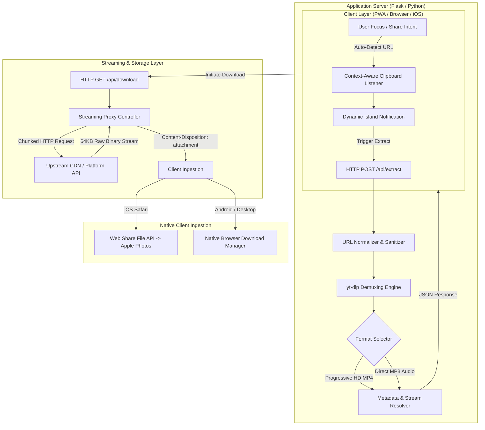

# AshxStudio

> **Production Deployment:** [https://ashxfacebook.onrender.com/](https://ashxfacebook.onrender.com/)  
> **System Status:** Operational (24/7 Active Monitoring via UptimeRobot)

AshxStudio is a high-throughput multimedia extraction and streaming engine built with a Python backend and an iOS-grade responsive web interface. The system provides progressive video demuxing (up to 1080p Full HD) and high-bitrate audio extraction (320kbps MP3) across major content distribution platforms, including Facebook, Instagram, YouTube, and WhatsApp.

---

## System Architecture & Workflow

The platform operates on a decoupled client-server architecture designed to eliminate local disk I/O bottlenecks and resolve cross-origin resource sharing (CORS) restrictions through real-time binary stream proxying.



---

## Technical Workflow Stages

### 1. Ingestion & Context Detection
- **Auto-Clipboard Resolution:** Event listeners (`window:focus`, `document:visibilitychange`) query `navigator.clipboard` to identify valid media URIs upon user return, triggering contextual UI prompts without manual pasting.
- **Progressive Web App (PWA) Target:** Integrated Android Share Target handlers intercept incoming URI intents directly from native social applications.

### 2. Stream Resolution & Demuxing
- **Engine:** Python Flask layer coupled with `yt-dlp` using platform-specific extraction arguments (e.g., mobile client emulation).
- **Progressive Selection:** Formats are filtered to prioritize combined video and audio streams over segmented DASH/HLS playlists, ensuring out-of-the-box container integrity.

### 3. Server-Side Binary Chunk Proxy
- **Zero-Disk Streaming:** Direct `stream_with_context` implementation pipes upstream CDN data in 64 KB memory chunks directly to the HTTP response buffer.
- **Content Verification:** Upstream responses are validated for binary MIME types before streaming, preventing corrupt HTML/error pages from being saved as media files.

### 4. Platform-Specific Delivery
- **iOS Photos Integration:** Implements the Web Share File API (`navigator.share({ files })`) to allow iPhone users to write MP4 files directly to the Camera Roll.
- **Desktop & Android:** Dispatches native attachment headers for direct filesystem writes.

---

## Tech Stack

| Layer | Technologies |
| :--- | :--- |
| **Backend Runtime** | Python 3.10+, Flask, Gunicorn |
| **Core Media Engine** | yt-dlp, Requests |
| **Client Frontend** | Vanilla JavaScript (ES6+), Tailwind CSS, Plus Jakarta Sans, Inter |
| **Mobile Integration** | Service Worker (Cache-First Precache), Web App Manifest, Web Share API |
| **Infrastructure** | Render Web Services, GitHub Actions CI/CD, UptimeRobot |

---

## Local Development

### Prerequisites
- Python 3.10 or higher
- Git

### Installation

```bash
# Clone the repository
git clone https://github.com/aswinhub26/AshxStudio.git
cd AshxStudio

# Install required Python packages
pip install -r requirements.txt

# Start local server
python app.py
```

The application will be accessible at `http://127.0.0.1:5000`.

---

## Production Deployment (Render)

1. Connect the GitHub repository to [Render.com](https://render.com/).
2. Create a new **Web Service** with the following parameters:
   - **Environment:** `Python 3`
   - **Build Command:** `pip install -r requirements.txt`
   - **Start Command:** `gunicorn app:app`
   - **Plan:** `Free`
3. Configure a 5-minute health check monitor via UptimeRobot targeting `/` to avoid cold-start instance spin-down.

---

## License

This project is licensed under the MIT License.
